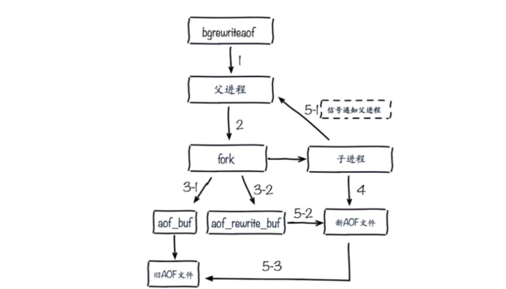
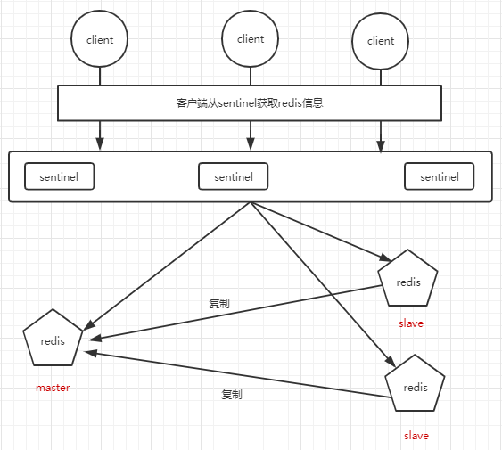

# 简介

1. 高性能Key-Value服务器
2. 支持多种数据结构
3. 功能丰富
4. 高可用分布式支持

# 特性

## 速度快
官方：10W OPS
数据存在内存
使用C语言编写
单线程模型

## 持久化（断电不丢数据）
对数据更新将异步地保存的磁盘上

## 支持多种数据结构
支持字符串、哈希、链表、集合、有序集合
新版本支持位图（BitMaps）
HyperLogLog：超小内存唯一值计数
GEO:地理信息定位

##  支持多种编程语言
java
php
lua

## 功能丰富
发布订阅
事务
Lua脚本
pipeline

##  简单
源码少（带着问题看代码）
不依赖外部库

## 主从复制（重点）
从服务器复制到主服务器

## 高可用、分布式
高可用----Redis-Sentinel  支持高可用
分布式----Redis-Cluster 支持分布式

# 使用场景
* 缓存系统
  提高响应速度
* 计数器
  利用自增incr、decr可以实现计数器
  转发数、评论数（微博）
* 消息队列系统
  利用pub、sub模式发布订阅消息系统
* 排行榜
  利用有序集合zset进行排序，得出排行榜
* 社交网络
* 实时系统  
* 限流

## 启动方式
* 生产环境选择配置启动
* 单机多实例配置文件可以用端口区分开

# 常用配置
daemonize:是否是守护进程（no/yes）  建议yes
port:Redis对外端口
logfile:Redis日志系统
dir:Redis工作目录

# API的使用

## 通用命令
* keys(O(n)级：一般不在生产环境使用)
* dbsize（O(1)级:计算key大小）
* exists key（检查key是否存在1为存在2为不存在）
* del key [key ...]
* expire key seconds
* type key

## Redis使用单线程还这么快？
1. 纯内存
2. 非阻塞IO（使用epoll模型）
3. 避免线程切换和竞态消耗

## set setnx setxx
set key value:不管key是否存在，都设置
setnx key value:key不存在，才设置(可看做添加操作)
set key value xx :key存在，才设置(可看做编辑操作)

# Redis的扩展

## 慢查询
* 生命周期
客户端发送命令到服务端，此时服务端有多条命令在执行，因为redis是单线程的，所以得排队等待执行命令，等待过程中会消耗一定是时间，最后返回结果
* 说明
1. 慢查询发生在第三阶段（执行命令，例如：key *）
2. 客户端超时不一定慢查询，但慢查询是客户端超时的一个可能因素
* 配置-slowlog-max-len = 128（支持动态配置）
1. 先进先出队列
2. 固定长度
3. 保存在内存中
* 配置-slowlog-log-slower-than = 10000（支持动态配置）
1. 慢查询阈值（单位：微秒）
2. slowlog-log-slower-than=0，记录所有命令
3. slowlog-log-slower-than<0，不记录命令

## 执行批量命令时，可使用pipeline4.3

## 发布订阅
角色：发布者  订阅者  频道

# Redis持久化

## 作用
redis所有数据保存在内存中，对数据的更新将异步地保存在磁盘上。

## 持久化方式
* 快照
1. MySQL Dump
2. Redis RDB
* 写日志
1. MySQL Binlog
2. Hbase HLog
3. Redis AOF

## Redis RDB
RDB:redis创建RDB文件（二进制）选在硬盘中，类似备份

### 触发机制
1. sava（同步）
介绍：执行sava命令会创建RDB文件（二进制）
缺点：会造成阻塞
注意：会覆盖旧的RDB文件
复杂度：O(N)
2. bgsava（异步）
介绍：执行bgsava命令，redis会fork（）redis的子进程，由子进程去创建RDB文件
3. 自动
通过配置自动生成RDB
* 方式
1. 全量复制
2. debug reload
3. shutdown

### 缺点
耗时耗性能

### sava和bgsava的区别

| 命令   | save             | bgsave               |
| ------ | ---------------- | -------------------- |
| IO类型 | 同步             | 异步                 |
| 阻塞？ | 是               | 是（阻塞发生在fork） |
| 复杂度 | O(n)             | O(n)                 |
| 优点   | 不会消耗额外内存 | 不阻塞客户端命令     |
| 缺点   | 阻塞客户端命令   | 需要fork，消耗内存   |

## AOF
日志原理

### 三种策略
1. always
redis写命令刷新的缓冲区，然后再每条命令fsync到硬盘上
2. everysec
redis写命令刷新的缓冲区，然后再每秒把缓冲区fsync到硬盘上
3. no
由操作系统决定

### 比较

| 命令 | always                            | everysec                | no     |
| ---- | --------------------------------- | ----------------------- | ------ |
| 优点 | 不丢失数据                        | 每秒一次fsync丢一秒数据 | 不用管 |
| 缺点 | IO开销较大，一般SATA盘只有几百TPS | 丢一秒数据              | 不可控 |

### AOF重写

#### 作用
* 减少硬盘占用量
* 加速恢复速度

#### 实现方式
1. bgrewriteaof命令
    fork子进程进行AOF重写

2. AOF重写配置
* 配置

| 配置名                      | 含义                  |
| --------------------------- | --------------------- |
| auto-aof-rewrite-min-size   | AOF文件重写需要的尺寸 |
| auto-aof-rewrite-percentage | AOF文件增长率         |

* 统计

| 统计名           | 含义                                  |
| ---------------- | ------------------------------------- |
| aof_current_size | AOF当前尺寸（单位：字节）             |
| aof_base_size    | AOF上次启动和重写的尺寸（单位：字节） |

#### AOF重写流程

#### 配置
appendonly     yes

## 两种持久化的比较和选择

### 对比

| 命令       | RDB    | AOF          |
| ---------- | ------ | ------------ |
| 启动优先级 | 低     | 高           |
| 体积       | 小     | 大           |
| 恢复速度   | 快     | 慢           |
| 数据安全性 | 丢数据 | 根据策略决定 |
| 轻重       | 重     | 轻           |

### RDB最佳策略
建议关闭
集中管理
主从，从开

### AOF最佳策略
建议开
AOF集中管理
建议每秒保存

# 主从复制

## 简介
数据副本
扩展读性能
一个master可以有多个slave
一个slave只能有一个master
数据是单向的

## 两种实现方式

### slaveof命令（异步）
例如：slaveof 127.0.0.1 6379  返回OK则复制成功
取消复制：slaveof no one

###  配置
slaveof ip port
从节点只读：slave-read-only yes

### 比较

| 方式 | 命令       | 配置     |
| ---- | ---------- | -------- |
| 优点 | 无需重启   | 统一配置 |
| 缺点 | 不便于管理 | 需要重启 |

## 全量复制和部分复制

### 全量复制开销
1. bgsave时间
2. RDB文件网络传输时间
3. 从节点清空数据时间
4. 从节点加载RDB的时间

# Redis Sentinel

## 架构

## 故障处理
1. 多个sentinel发现并确认master有问题
2. 选举出一个sentinel作为领导
3. 选出一个slave作为master
4. 通知其余slave成为新的master的slave
5. 通知客户端主从变化
6. 等待老的master复活成为新的master的slave

## 三个定时任务
1. 每10秒每个sentinel对master和slave执行info
* 发现slave节点
* 确认主从关系
2. 每2秒每个sentinel通过master节点的channel交换信息（pub/sub）
* 通过_sentinel_:hello频道交互
* 交互节点的“看法”和自身信息
3. 每一秒每个sentinel对其他sentinel和redis执行ping
* 心跳检测，失败判定依据

# 缓存的使用与优化

## 缓存的收益与成本

### 收益
1. 加速读写
2. 降低后端负载

### 成本
1. 数据不一致：缓存层和数据层有时间窗口不一致，和更新策略有关。
2. 代码维护成本：多了一层缓存逻辑

## 缓存更新策略
1. LRU/LFU?FIFO算法剔除：例如maxmemory-policy
2. 超时剔除：例如expire
3. 主动更新：开发控制生命周期

### 建议
1. 低一致性：最大内存和淘汰策略
2. 高一致性：超时剔除和主动更新结合，最大内存和淘汰策略兜底

## 缓存粒度控制
1. 通用性：全量属性更好
2. 占用空间：部分属性更好
3. 代码维护：表面上全量属性更好

## 缓存穿透问题--大量请求不命中

### 原因
1. 业务代码自身问题
2. 恶意攻击、爬虫等等

### 解决方法1一缓存空对象
先从缓存中获取值，如果为空，则进去持久层获取值在放进缓存，如果持久层获取的数据也为空，则设置缓存超时时间

### 解决方法2一布隆过滤器拦截

## 无底洞问题

## 热点key的重建优化

### 目标
1. 减少重缓存的次数
2. 数据尽可能一致
3. 减少潜在危险

### 解决
1. 互斥锁（mutex key）
2. 永不过去