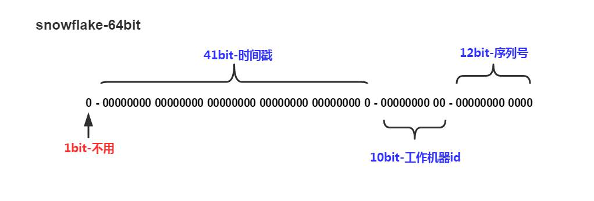

> SnowFlake 算法，是 Twitter 开源的分布式 id 生成算法。其核心思想就是：使用一个 64 bit 的 long 型的数字作为全局唯一 id。在分布式系统中的应用十分广泛，且ID 引入了时间戳，基本上保持自增的。整个分布式系统内不会产生ID碰撞（由datacenter和机器ID作区分）， 并且效率较高，经测试，snowflake每秒能够产生26万ID左右，完全满足需要。

# 雪花算法的原理



## 雪花算法由四部分组成

1. 第一部分是1个bit，始终为0，不可用。

   （因为二进制里第一个 bit 为如果是 1，那么都是负数，但是我们生成的 id 都是正数，所以第一个 bit 统一都是 0。）

2. 第二部分是41bit的时间戳，单位是毫秒。

   （41 bit 可以表示的数字多达 2^41 - 1，也就是可以标识 2 ^ 41 - 1 个毫秒值，换算成年就是表示 69 年的时间。）

3. 第三部分是10bit的工作机器ID，由5个bit的机房ID和5个bit的机器ID组成。

   （代表 2 ^ 5 个机房（32 个机房），每个机房里可以代表 2 ^ 5 个机器（32 台机器），也就是代表可以部署在1024台机器上。）

4. 第四部分是12个bit的序号，就是某个机房某台机器上这一毫秒内同时生成的 id 的序号，0000 00000000。

   （12 bit 可以代表的最大正整数是 2 ^ 12 - 1 = 4096，也就是说可以用这个 12 bit 代表的数字来区分同一个毫秒内的 4096 个不同的 id。）

# 雪花算法的实现

```
public class IdWorker {
    // 时间起始标记点，作为基准，一般取系统的最近时间（一旦确定不能变动）
    private final static long twepoch = 1288834974657L;
    // 机器标识位数
    private final static long workerIdBits = 5L;
    // 数据中心标识位数
    private final static long datacenterIdBits = 5L;
    // 机器ID最大值
    private final static long maxWorkerId = -1L ^ (-1L << workerIdBits);
    // 数据中心ID最大值
    private final static long maxDatacenterId = -1L ^ (-1L << datacenterIdBits);
    // 毫秒内自增位
    private final static long sequenceBits = 12L;
    // 机器ID偏左移12位
    private final static long workerIdShift = sequenceBits;
    // 数据中心ID左移17位
    private final static long datacenterIdShift = sequenceBits + workerIdBits;
    // 时间毫秒左移22位
    private final static long timestampLeftShift = sequenceBits + workerIdBits + datacenterIdBits;

    private final static long sequenceMask = -1L ^ (-1L << sequenceBits);
    /* 上次生产id时间戳 */
    private static long lastTimestamp = -1L;
    // 0，并发控制
    private long sequence = 0L;

    private final long workerId;
    // 数据标识id部分
    private final long datacenterId;

    public IdWorker(){
        this.datacenterId = getDatacenterId(maxDatacenterId);
        this.workerId = getMaxWorkerId(datacenterId, maxWorkerId);
    }
    /**
     * @param workerId
     *            工作机器ID
     * @param datacenterId
     *            序列号
     */
    public IdWorker(long workerId, long datacenterId) {
        if (workerId > maxWorkerId || workerId < 0) {
            throw new IllegalArgumentException(String.format("worker Id can't be greater than %d or less than 0", maxWorkerId));
        }
        if (datacenterId > maxDatacenterId || datacenterId < 0) {
            throw new IllegalArgumentException(String.format("datacenter Id can't be greater than %d or less than 0", maxDatacenterId));
        }
        this.workerId = workerId;
        this.datacenterId = datacenterId;
    }
    /**
     * 获取下一个ID，核心
     *
     * @return
     */
    public synchronized long nextId() {
    	// 获取当前时间戳，单位是毫秒
        long timestamp = timeGen();
        if (timestamp < lastTimestamp) {
            throw new RuntimeException(String.format("Clock moved backwards.  Refusing to generate id for %d milliseconds", lastTimestamp - timestamp));
        }

		// 下面是说假设在同一个毫秒内，又发送了一个请求生成一个id
        // 这个时候就得把seqence序号给递增1，最多就是4096
        if (lastTimestamp == timestamp) {
            // 这个意思是说一个毫秒内最多只能有4096个数字，无论你传递多少进来，
            // 这个位运算保证始终就是在4096这个范围内，避免你自己传递个sequence超过了4096这个范围
            sequence = (sequence + 1) & sequenceMask;
            if (sequence == 0) {
                // 当前毫秒内计数满了，则等待下一秒
                timestamp = tilNextMillis(lastTimestamp);
            }
        } else {
            sequence = 0L;
        }
        // 记录最近一次生成id的时间戳，单位是毫秒
        lastTimestamp = timestamp;
        // 这儿就是最核心的二进制位运算操作，生成一个64bit的id
        // 先将当前时间戳左移，放到41 bit那儿；将机房id左移放到5 bit那儿；将机器id左移放到5 bit那儿；			将序号放最后12 bit
        // 最后拼接起来成一个64 bit的二进制数字，转换成10进制就是个long型
        long nextId = ((timestamp - twepoch) << timestampLeftShift)
                | (datacenterId << datacenterIdShift)
                | (workerId << workerIdShift) | sequence;

        return nextId;
    }

    private long tilNextMillis(final long lastTimestamp) {
        long timestamp = this.timeGen();
        while (timestamp <= lastTimestamp) {
            timestamp = this.timeGen();
        }
        return timestamp;
    }

    private long timeGen() {
        return System.currentTimeMillis();
    }

    /**
     * <p>
     * 获取 maxWorkerId
     * </p>
     */
    protected static long getMaxWorkerId(long datacenterId, long maxWorkerId) {
        StringBuffer mpid = new StringBuffer();
        mpid.append(datacenterId);
        String name = ManagementFactory.getRuntimeMXBean().getName();
        if (!name.isEmpty()) {
         /*
          * GET jvmPid
          */
            mpid.append(name.split("@")[0]);
        }
      /*
       * MAC + PID 的 hashcode 获取16个低位
       */
        return (mpid.toString().hashCode() & 0xffff) % (maxWorkerId + 1);
    }

    /**
     * <p>
     * 数据标识id部分
     * </p>
     */
    protected static long getDatacenterId(long maxDatacenterId) {
        long id = 0L;
        try {
            InetAddress ip = InetAddress.getLocalHost();
            NetworkInterface network = NetworkInterface.getByInetAddress(ip);
            if (network == null) {
                id = 1L;
            } else {
                byte[] mac = network.getHardwareAddress();
                id = ((0x000000FF & (long) mac[mac.length - 1])
                        | (0x0000FF00 & (((long) mac[mac.length - 2]) << 8))) >> 6;
                id = id % (maxDatacenterId + 1);
            }
        } catch (Exception e) {
            System.out.println(" getDatacenterId: " + e.getMessage());
        }
        return id;
    }
}
```

