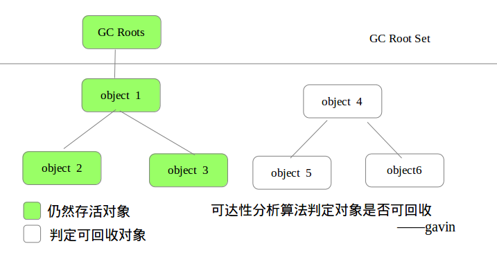
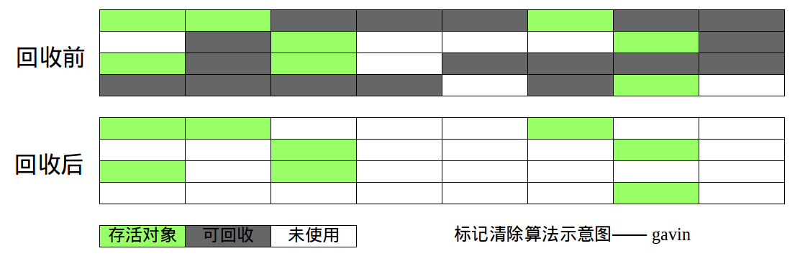
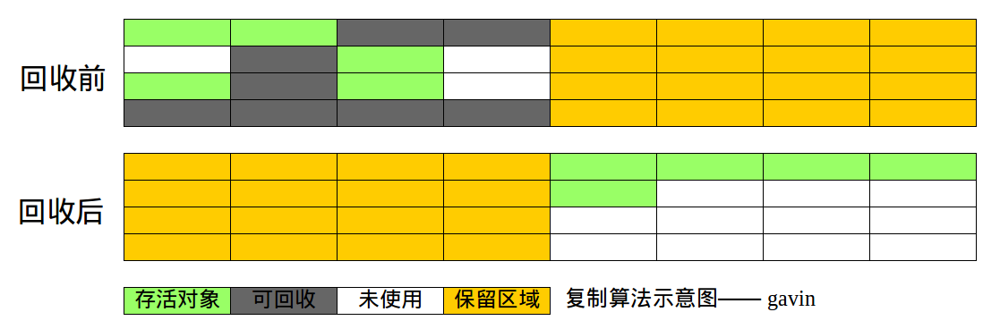
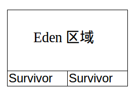
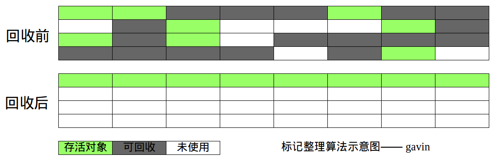

>  读《深入理解Java虚拟机》记录
>
>  当需要排查各种内存溢出、内存泄漏问题时，当垃圾收集成为系统达到更高并发量的瓶颈时，我们就需要对这些“自动化”的技术实施必要的监控和调节。

# Java内存哪个区域需要做垃圾收集？

> Java堆和方法区

程序计数器、虚拟机栈、本地方法栈3个区域随线程而生，随线程而灭；栈中的栈帧随着方法的进入和退出而有条不紊地执行着出栈和入栈操作。每一个栈帧中分配多少内存基本上是在类结构确定下来时就已知的（尽管在运行期会由JIT编译器进行一些优化，但在本章基于概念模型的讨论中，大体上可以认为是编译期可知的），因此这几个区域的内存分配和回收都具备确定性，在这几个区域内就不需要过多考虑回收的问题，因为方法结束或者线程结束时，内存自然就跟随着回收了。

而Java堆和方法区则不一样，一个接口中的多个实现类需要的内存可能不一样，一个方法中的多个分支需要的内存也可能不一样，我们只有在程序处于运行期间时才能知道会创建哪些对象，这部分内存的分配和回收都是动态的，垃圾收集器所关注的是这部分内存。

# 如何确定对象已“死”

在堆里面存放着Java世界中几乎所有的对象实例，垃圾收集器在对堆进行回收前，第一件事情就是要确定这些对象之中哪些还“存活”着，哪些已经“死去”（即不可能再被任何途径使用的对象）。

## 引用计数算法

给对象中添加一个引用计数器，每当有一个地方引用它时，计数器值就加1；当引用失效时，计数器值就减1；任何时刻计数器为0的对象就是不可能再被使用的。

## 可达性分析算法

在主流的商用程序语言（Java、C#，甚至包括前面提到的古老的Lisp）的主流实现中，都是称通过可达性分析（Reachability Analysis）来判定对象是否存活的。

这个算法的基本思路就是通过一系列的称为“GC Roots”的对象作为起始点，从这些节点开始向下搜索，搜索所走过的路径称为引用链（Reference Chain），当一个对象到GC Roots没有任何引用链相连（用图论的话来说，就是从GC Roots到这个对象不可达）时，则证明此对象是不可用的。

## 引用补充

无论是通过引用计数算法判断对象的引用数量，还是通过可达性分析算法判断对象的引用链是否可达，判定对象是否存活都与“引用”有关。如果reference类型的数据中存储的数值是另一块内存的起始地址，那么这块内存就代表着一个引用。一个对象在这种状态下，只能有被引用和没有被引用两种状态。

| 引用类型 | 创建方式                          | 生存时长                   |
| -------- | --------------------------------- | -------------------------- |
| 强引用   | new                               | GC不回收                   |
| 软引用   | SoftReference                     | 内存足够GC不回收，不足回收 |
| 弱引用   | WeakReference                     | GC必回收                   |
| 虚引用   | PhantomReference + ReferenceQueue | 任何情况下都回收           |

## 对象的死亡过程

要真正宣告一个对象死亡，至少要经历两次标记过程：

* 如果对象在进行可达性分析后发现没有与GC Roots相连接的引用链，那它将会被第一次标记并且进行一次筛选，筛选的条件是此对象是否有必要执行finalize()方法（当对象没有覆盖finalize()方法，或者finalize()方法已经被虚拟机调用过，虚拟机将这两种情况都视为“没有必要执行”。）
* 如果这个对象被判定为有必要执行finalize()方法，那么这个对象将会放置在一个叫做F-Queue的队列之中，并在稍后由一个由虚拟机自动建立的、低优先级的Finalizer线程去执行它。稍后GC将对F-Queue中的对象进行第二次小规模的标记，如果还没有被引用，则会被回收。

## 回收方法区

很多人认为方法区（HotSopt中的永久代）是没有垃圾收集的，java虚拟机规范中也没有要求需要对方法区实现垃圾收集。

> 永久代(方法区)的垃圾收集主要回收两部分内容:废弃常量和无用的类

* **废弃常量**：假如一个字符串`“abc”`已经进入了常量池中，但是当前系统没有任何一个String对象是叫 做`“abc”`的，换句话说，就是没有任何String对象引用常量池中的`“abc”`常量，也没有其他 - 地方引用了这个字面量，如果这时发生内存回收，而且必要的话，这个`“abc”`常量就会被系 - 统清理出常量池。
* **无用的类**：同时满足下面3个条件的类（实例、类加载器被回收，`java.lang.Class`对象没有被引用）。

1. 该类**所有的实例**都已经被回收，也就是Java**堆中不存在该类的任何实例**。
2. 加载该类的`ClassLoader`已经被回收。
3. 该类对应的`java.lang.Class`对象没有在任何地方被引用，无法在任何地方通过反射访问该类的方法。

# 垃圾回收算法

## 标记-清除算法（Mark-Sweep）

该算法分为两个阶段：首先标记处要回收的对象，标记完成后统一回收所有被标记的对象。

缺点：

1. 效率问题，标记和清除两个过程的效率都不高
2. 空间问题，标记清除之后会产生大量不连续的内存碎片，空间碎片太多可能会导致以后在程序运行过程中需要分配较大对象时，无法找到足够的连续内存,而不得不提前触发另一次垃圾收集动作

## 复制算法（新生代算法）(Copying)

思路：将可用内存按容量分为两个块，每次只用其中之一。当这一块内存用完之后，将还存活的对象复制到另一边去，然后清除所有已经使用过的部分。

优点

* 避免了内存碎片的产生

缺点

* 将内存缩小为了原来的一半，浪费内存空间

解决方法

* 新生代中的对象98%是“朝生夕死”的，所以并不需要按照1:1的比例来划分内存空间，而是将内存分为一块较大的`Eden空间`和两块较小的`Survivor空间`，每次使用`Eden`和其中一块`Survivor`。
* 在HotSpot里，考虑到大部分对象存活时间很短将内存分为`Eden`和两块`Survivor`，默认比例为8:1:1。代价是存在部分内存空间浪费，适合在新生代使用。

## 标记-整理算法（老年代算法）(Mark-Compact)

标记过程仍然与“标记-清除”算法一样，但后续步骤不是直接对可回收对象进行清理，而是让所有存活的对象都向一端移动，然后直接清理掉端边界以外的内存。

## 分代收集理论

* 当前商用虚拟机都采用了这种算法，根据对象的存活周期将内存划分为几块，一般是把Java堆分为**新生代和老生代**，根据**各个年代采用适当的收集算法**。
* 新生代存活率低，一般采用**复制算法(Copying)**。

- 老生代存活率高，一般采用 **标记-清理(Mark-Sweep) 或者标记-整理(Mark-Compact)** 进行回收。