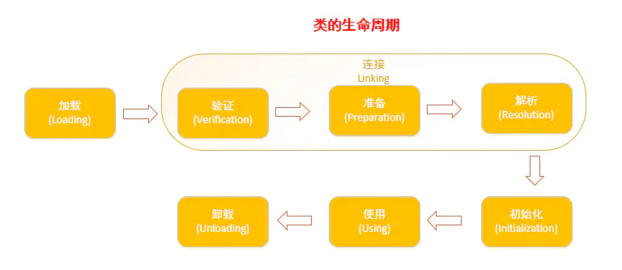

>  读《深入理解Java虚拟机》记录
>
>  虚拟机把类的数据从Class文件(这里的Class文件可以是javac编译成的class文件，也可以是反射或者动态代理生成的class二进制流，或者网络传输的二进制流等等)加载到内存，并对数据进行校验，转换解析和初始化，最终形成可以被虚拟机直接使用的Java类型的过程就是虚拟机的类加载机制。

# 虚拟机什么时候才会加载Class文件并初始化类呢？（类加载的时机）

类从被加载到虚拟机内存中开始，到卸载出内存为止，它的整个生命周期包括：加载(Loading)、验证(Verification)、准备(Preparation)、解析(Resolution)、初始化(Initialization)、使用(Using)和卸载(Unloading)七个阶段。其中准备、验证、解析三个部分统称为连接(Linking)。



加载、验证、准备、初始化和卸载5个阶段的顺序是确定的，类的加载过程必须按照这种顺序按部就班地开始，而解析阶段则不一定：它在某些情况下可以再初始化阶段后再开始，这是为了支持Java语言的运行时绑定(也称动态绑定或晚期绑定)。注意：类的加载过程必须按照这种顺序**按部就班**地开始，而不是**按部就班**地进行或完成，因为这些阶段通常都是相互交叉地混合式进行的，通常会在一个阶段执行的过程中调用、激活另外一个阶段。

Java虚拟机规范中并没有进行强制约束，这点可以交给虚拟机的具体实现来自由把握。但是对于初始化阶段，虚拟机规范则是严格规定了有且只有5种情况必须立即对类进行“初始化”（而加载、验证、准备自然需要在此之前开始），具体5种情况如下

1. 遇到new、getstatic、putstatic或invokestatic这4条字节码指令时，如果类没有进行过初始化，则需要先触发其初始化。生成这4条指令的最常见的Java代码场景是：使用new关键字实例化对象的时候、读取或设置一个类的静态字段（被final修饰、已在编译期把结果放入常量池的静态字段除外）的时候，以及调用一个类的静态方法的时候。
2. 使用java.lang.reflect包的方法对类进行反射调用的时候，如果类没有进行过初始化，则需要先触发其初始化。
3. 当初始化一个类的时候，如果发现其父类还没有进行过初始化，则需要先触发其父类的初始化。
4. 当虚拟机启动时，用户需要指定一个要执行的主类（包含main（）方法的那个类），虚拟机会先初始化这个主类。
5. 当使用JDK1.7的动态语言支持时，如果一个java.lang.invoke.MethodHandle实例最后的解析结果REF_getStatic、REF_putStatic、REF_invokeStatic的方法句柄，并且这个方法句柄所对应的类没有进行过初始化，则需要先触发其初始化。

# 虚拟机加载一个Class文件要经历那些具体的步骤呢？(类加载的过程)

## 加载：查找并加载类的二进制数据

加载是类加载过程的第一个阶段，在加载阶段，虚拟机需要完成以下三件事情：

1. 通过一个类的全限定名来获取其定义的二进制字节流。

2. 将这个字节流所代表的静态存储结构转化为方法区的运行时数据结构。

3. 在Java堆中生成一个代表这个类的java.lang.Class对象，作为对方法区中这些数据的访问入口。

注意，这里第1条中的二进制字节流并不只是单纯地从Class文件中获取，比如它还可以从Jar包中获取、从网络中获取（最典型的应用便是Applet）、由其他文件生成（JSP应用）等。

  相对于类加载的其他阶段而言，加载阶段（准确地说，是加载阶段获取类的二进制字节流的动作）是可控性最强的阶段，因为开发人员既可以使用系统提供的类加载器来完成加载，也可以自定义自己的类加载器来完成加载。

  加载阶段完成后，虚拟机外部的二进制字节流就按照虚拟机所需的格式存储在方法区之中，而且在`Java堆中也创建一个java.lang.Class类的对象`，这样便可以通过该对象访问方法区中的这些数据。

## 验证：确保被加载的类的正确性

验证是连接阶段的第一步，这一阶段的目的是为了确保Class文件的字节流中包含的信息符合当前虚拟机的要求，并且不会危害虚拟机自身的安全。验证阶段大致会完成4个阶段的检验动作：

**文件格式验证**：验证字节流是否符合Class文件格式的规范；例如：是否以0xCAFEBABE开头、主次版本号是否在当前虚拟机的处理范围之内、常量池中的常量是否有不被支持的类型。

**元数据验证**：对字节码描述的信息进行语义分析（注意：对比javac编译阶段的语义分析），以保证其描述的信息符合Java语言规范的要求；例如：这个类是否有父类，除了java.lang.Object之外。

**字节码验证**：通过数据流和控制流分析，确定程序语义是合法的、符合逻辑的。

**符号引用验证**：确保解析动作能正确执行。

验证阶段是非常重要的，但不是必须的，它对程序运行期没有影响，如果所引用的类经过反复验证，那么可以考虑采用-Xverifynone参数来关闭大部分的类验证措施，以缩短虚拟机类加载的时间。

## 准备：为类的静态变量分配内存，并将其初始化为默认值

准备阶段是正式为类变量分配内存并设置类变量初始值的阶段，这些内存都将在方法区中分配。对于该阶段有以下几点需要注意：

1. 这时候进行内存分配的仅包括类变量（static），而不包括实例变量，实例变量会在对象实例化时随着对象一块分配在Java堆中。

2. 这里所设置的初始值通常情况下是数据类型默认的零值（如0、0L、null、false等），而不是被在Java代码中被显式地赋予的值。

  假设一个类变量的定义为：public static int value = 3；

  那么变量value在准备阶段过后的初始值为0，而不是3，因为这时候尚未开始执行任何Java方法，而把value赋值为3的putstatic指令是在程序编译后，存放于类构造器<clinit>（）方法之中的，所以把value赋值为3的动作将在初始化阶段才会执行。

```
· 这里还需要注意如下几点：
· 对基本数据类型来说，对于类变量（static）和全局变量，如果不显式地对其赋值而直接使用，则系统会为其赋予默认的零值，而对于局部变量来说，在使用前必须显式地为其赋值，否则编译时不通过。
· 对于同时被static和final修饰的常量，必须在声明的时候就为其显式地赋值，否则编译时不通过；而只被final修饰的常量则既可以在声明时显式地为其赋值，也可以在类初始化时显式地为其赋值，总之，在使用前必须为其显式地赋值，系统不会为其赋予默认零值。
· 对于引用数据类型reference来说，如数组引用、对象引用等，如果没有对其进行显式地赋值而直接使用，系统都会为其赋予默认的零值，即null。
· 如果在数组初始化时没有对数组中的各元素赋值，那么其中的元素将根据对应的数据类型而被赋予默认的零值。
```

3. 如果类字段的字段属性表中存在ConstantValue属性，即同时被final和static修饰，那么在准备阶段变量value就会被初始化为ConstValue属性所指定的值。

  假设上面的类变量value被定义为： public static final int value = 3；

  编译时Javac将会为value生成ConstantValue属性，在准备阶段虚拟机就会根据ConstantValue的设置将value赋值为3。我们可以理解为static final常量在编译期就将其结果放入了调用它的类的常量池中

## 解析：把类中的符号引用转换为直接引用

解析阶段是虚拟机将常量池内的符号引用替换为直接引用的过程，解析动作主要针对类或接口、字段、类方法、接口方法、方法类型、方法句柄和调用点限定符7类符号引用进行。

**符号引用**就是一组符号来描述目标，可以是任何字面量。

**直接引用**就是直接指向目标的指针、相对偏移量或一个间接定位到目标的句柄。

## 初始化

初始化，为类的静态变量赋予正确的初始值，JVM负责对类进行初始化，主要对类变量进行初始化。在Java中对类变量进行初始值设定有两种方式：

1. 声明类变量是指定初始值

2. 使用静态代码块为类变量指定初始值

 JVM初始化步骤

1. 假如这个类还没有被加载和连接，则程序先加载并连接该类

2. 假如该类的直接父类还没有被初始化，则先初始化其直接父类

3. 假如类中有初始化语句，则系统依次执行这些初始化语句

**结束生命周期**

在如下几种情况下，Java虚拟机将结束生命周期

* 执行了System.exit()方法

* 程序正常执行结束

* 程序在执行过程中遇到了异常或错误而异常终止

* 由于操作系统出现错误而导致Java虚拟机进程终止

#  虚拟机如何加载一个Class文件呢？(Java类加载的方式：类加载器、双亲委派机制)

## 类加载器

类加载器：虚拟机设计团队将类加载阶段的类加载过程中的加载动作，放到虚拟机外部实现，也就是可以运行开发人员自己觉得如何获取所需要的类，这个加载动作的实现就是类加载器。

类加载器的层次关系如下图所示：


站在虚拟机的角度来看，只有两种加载器，一种是启动类加载器，是有C++语言实现的，是虚拟机的一部分；另外一部分是所有的其他类加载器，由Java语言编写，独立于虚拟机之外，都继承自抽象类java.lang.ClassLoader。

站在Java开发人员的角度来看，类加载器可以大致划分为以下三类：

**启动类加载器**：Bootstrap ClassLoader，负责加载存放在JDK\jre\lib(JDK代表JDK的安装目录，下同)下，或被-Xbootclasspath参数指定的路径中的，并且能被虚拟机识别的类库（如rt.jar，所有的java.*开头的类均被Bootstrap ClassLoader加载）。启动类加载器是无法被Java程序直接引用的。

**扩展类加载器**：Extension ClassLoader，该加载器由sun.misc.Launcher$ExtClassLoader实现，它负责加载DK\jre\lib\ext目录中，或者由java.ext.dirs系统变量指定的路径中的所有类库（如javax.*开头的类），开发者可以直接使用扩展类加载器。

**应用程序类加载器**：Application ClassLoader，该类加载器由sun.misc.Launcher$AppClassLoader来实现，它负责加载用户类路径（ClassPath）所指定的类，开发者可以直接使用该类加载器，如果应用程序中没有自定义过自己的类加载器，一般情况下这个就是程序中默认的类加载器。

应用程序都是由这三种类加载器互相配合进行加载的，如果有必要，我们还可以加入自定义的类加载器。因为JVM自带的ClassLoader只是懂得从本地文件系统加载标准的java class文件，因此如果编写了自己的ClassLoader，便可以做到如下几点：

1）在执行非置信代码之前，自动验证数字签名。

2）动态地创建符合用户特定需要的定制化构建类。

3）从特定的场所取得java class，例如数据库中和网络中。

JVM类加载机制：

* 全盘负责：当一个类加载器负责加载某个Class时，该Class所依赖的和引用的其他Class也将由该类加载器负责载入，除非显示使用另外一个类加载器来载入

* 父类委托：先让父类加载器试图加载该类，只有在父类加载器无法加载该类时才尝试从自己的类路径中加载该类

* 缓存机制：缓存机制将会保证所有加载过的Class都会被缓存，当程序中需要使用某个Class时，类加载器先从缓存区寻找该Class，只有缓存区不存在，系统才会读取该类对应的二进制数据，并将其转换成Class对象，存入缓存区。这就是为什么修改了Class后，必须重启JVM，程序的修改才会生效

**类的加载**

类加载有三种方式：

1. 命令行启动应用时候由JVM初始化加载

2. 通过Class.forName()方法动态加载

3. 通过ClassLoader.loadClass()方法动态加载

**Class.forName()和ClassLoader.loadClass()区别？**

Class.forName()：将类的.class文件加载到jvm中之外，还会对类进行解释，执行类中的static块；

ClassLoader.loadClass()：只干一件事情，就是将.class文件加载到jvm中，不会执行static中的内容,只有在newInstance才会去执行static块。

**注：**

Class.forName(name, initialize, loader)带参函数也可控制是否加载static块。并且只有调用了newInstance()方法采用调用构造函数，创建类的对象 。

## 双亲委派模型

双亲委派模型的工作流程是：如果一个类加载器收到了类加载的请求，它首先不会自己去尝试加载这个类，而是把请求委托给父加载器去完成，依次向上，因此，所有的类加载请求最终都应该被传递到顶层的启动类加载器中，只有当父加载器在它的搜索范围中没有找到所需的类时，即无法完成该加载，子加载器才会尝试自己去加载该类。

**双亲委派机制:**

1. 当AppClassLoader加载一个class时，它首先不会自己去尝试加载这个类，而是把类加载请求委派给父类加载器ExtClassLoader去完成。

2. 当ExtClassLoader加载一个class时，它首先也不会自己去尝试加载这个类，而是把类加载请求委派给BootStrapClassLoader去完成。

3. 如果BootStrapClassLoader加载失败（例如在$JAVA_HOME/jre/lib里未查找到该class），会使用ExtClassLoader来尝试加载；

4. 若ExtClassLoader也加载失败，则会使用AppClassLoader来加载，如果AppClassLoader也加载失败，则会报出异常ClassNotFoundException。

**双亲委派模型意义：**

* 系统类防止内存中出现多份同样的字节码

* 保证Java程序安全稳定运行